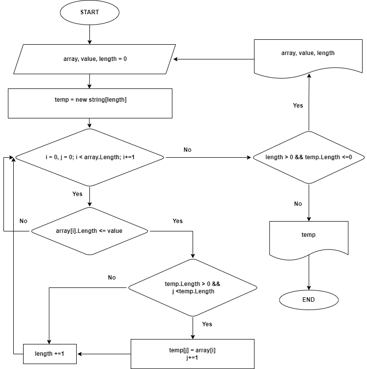

 # *Контрольная работа*

_**Задача**_: *Написать программу, которая из имеющегося массива строк формирует новый массив из строк,
 длина которых меньше, либо равна 3 символам. Первоначальный массив можно ввести с клавиатуры,
 либо задать на старте выполнения алгоритма. При решении не рекомендуется пользоваться коллекциями,
 лучше обойтись исключительно массивами.* 
 
 _**Например**_:
 
 [“Hello”, “2”, “world”, “:-)”] → [“2”, “:-)”] 
 
 [“1234”, “1567”, “-2”, “computer science”] → [“-2”][“Russia”, “Denmark”, “Kazan”] → []

## _Основной код_ :

1) Обращаемся к пользователю "Введите длину массива".
2) Обращаемся к пользователю "Введите длину строки для формирования ".
3) Метод FormationArray  формирует полученный массив и проверяет сколько подходящих элементов..
4) Метод FillArrayAnyValue перебирает полученный массив и проверяет подходит ли элемент по условию.
5) Выводим полученный массив строк согласно требованиям оформления в консоль.

## Метод *FormationArray* :
1) Принимает 3 аргумента
* массив типа string
* значение нужной длины элемента тип int
* не обязательный аргумент длина возврашаемого массива тип int

2) Формирует полученный массив и проверяет сколько подходящих элементов

3) Если подходяших элементов нет возврашает пустой массив

4) Если подходяших элементов больше 0 и длина временного массива меньше 0 метод вызывается рекурсивно с аргументами 

## Метод *FillArrayAnyValue* :
1) Принимает 
2) Перебирает полученный массив и проверяет подходит ли элемент по условию,
3) Если подходит записывает элемент во временный массив и возврашает временный массив

## Блок-Схема 

